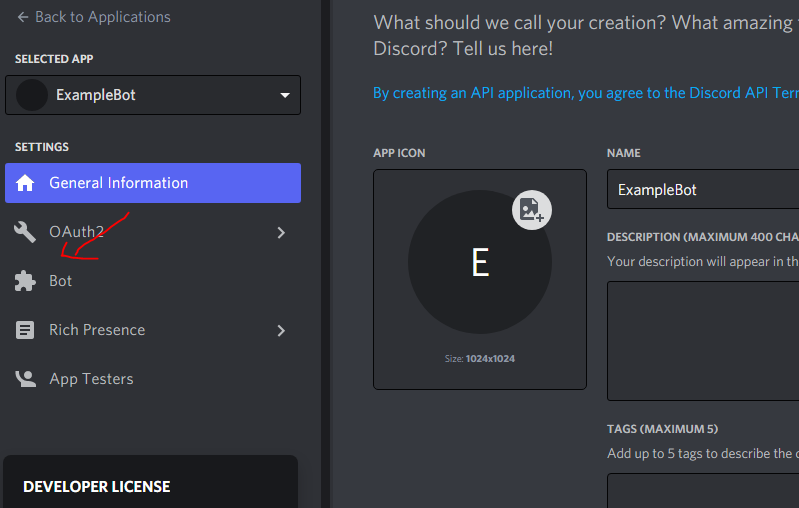
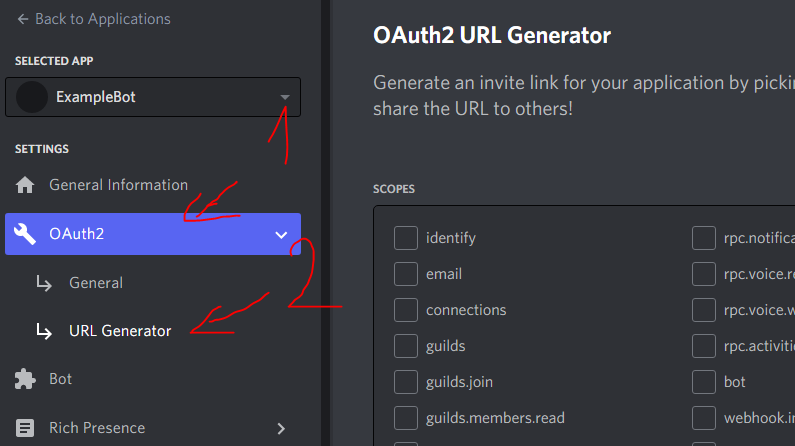

	<h2 align="center">
		<a href="http://github.com/Expectatives/Discord.js-v13-Example">Discord.js v13 Example Bot</a>
	</h2>

	<!--
		Static Badges
	-->
	˙
	
	 
	<!--
		Dinamic Badges
		Note: "../.." for escaping "blob/master"
	-->
	<!-- ˙ -->
	

---

> This is an example bot to make commands with categories using [Discord.js v13](http://discord.js.org/#/docs/discord.js/v13/general/welcome), a powerful JavaScript library for interacting with the [Discord API](http://discord.com/developers/docs).
> This bot contains examples of commands with legacy prefix ([deprecated](http://support-dev.discord.com/hc/en-us/articles/4404772028055)) and slash commands.

## Table of Contents

- [Table of Contents](#table-of-contents)
- [Getting started](#getting-started)
	- [Dependencies](#dependencies)
	- [How to run this project](#how-to-run-this-project)
		- [Bot preparing](#bot-preparing)
		- [Bot configuring](#bot-configuring)
	- [How to invite bot to a server](#how-to-invite-bot-to-a-server)
- [Heroku](#heroku)
- [Support Server](#support-server)
- [For contributors](#for-contributors)

---

## Getting started

### Dependencies

Launch requirements:

* [Node.js](http://nodejs.org) v17 or higher,
* [npm](http://npm.im/npm) v8 or higher *<small>(usually comes bundled with Node.js)</small>*.

Also:

* Application Bot on [Discord Developer Portal](http://discord.com/developers).

---

### How to run this project

#### Bot preparing
* Step 1: Go to [«My Applications» page on Discord Developer Portal](http://discord.com/developers/applications).

* Step 2: Click on the «New Application» button:

* Step 3: Write the name of your bot and click the «Create» button:

* Step 4: Go to the «Bot» category:

* Step 5: Click on the «Add Bot» button:

* Step 6: Click on the «Copy» button, this to copy the Bot Token:

#### Bot configuring

* Step 7: Rename `.env.example` to `.env`.
* Step 8: Edit `.env` file and paste your bot token.
* Step 9: Edit the `config.js` file to your liking.
* Step 10: Install bot dependencies with `npm i`.
* Step 11: Start the bot with `npm start`!

---

### How to invite bot to a server
* Step 1: Select your application, then click on "OAuth2" and open "URL Generator":

* Step 2: Here you have to select the permissions of your Bot, in SCOPES first select "Bot" and "applications.commands", then in BOT PERMISSIONS select "Administrator" and then below you will receive the invitation of your bot click on the «Copy» button

* Step 3: Paste the link of the invitation of your bot that you copy in a tab of your browser, then select the server and give the button "Continue" then the button "Authorize", after this complete the capcha and the bot would already be inside your server!

---

## Heroku

## Support Server

If you find an error or need support, go to my discord server and open a ticket:

	
<b>[ Discord Server Here ]</b>

    <a href="http://dsc.gg/faithcommunity">
        Faith Community | Services  
        
    </a>
<!-- If invite link is dead, redeem new one from our Discord server widget: [invidget.switchblade.xyz](http://invidget.switchblade.xyz/809598129313415241?theme=dark&language=en) or [Vanilla](http://discord.com/widget?id=809598129313415241&theme=dark). -->

## For contributors

 1. [Contributing](./.github/CONTRIBUTING.md)
 1. [Download](./.github/DOWNLOAD.md)
<!--  1. [ToDo list](./.github/TODO.md) -->

---

  

